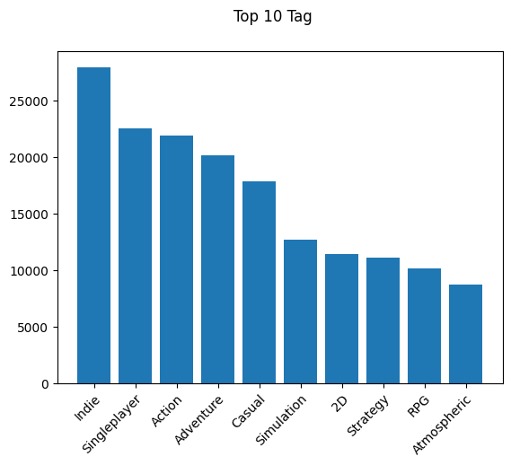
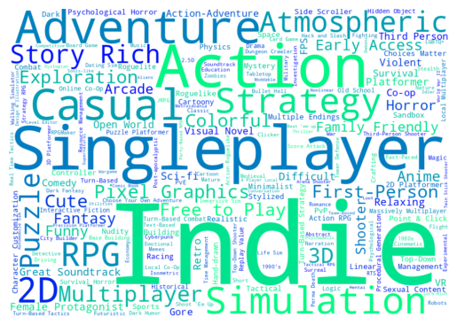

# Laporan Proyek Machine Learning - Ghifari Adil Ruchiyat

## 1. Project Overview

### Latar Belakang

Industri game telah berkembang cukup pesat dalam beberapa tahun terakhir. Hal ini dapat dipengaruhi oleh berbagai hal, seperti akses internet yang semakin mudah, perkembangan teknologi, serta popularitas eSport. Pada tahun 2017, pendapatan dari penjualan game oleh industri game terhitung sebesar $108.9 milyar USD.[^1] Di tahun 2018, terdapat sekitar 2 milyar pemain game aktif di seluruh dunia.[^2] Di Indonesia sendiri, pasar game di Indonesia masih tergolong muda. Meskipun begitu,  Indonesia tercatat telah mencapai jumlah yang sangat tinggi di tahun 2017, yakni $880 juta USD.[^3]

Perkembangan ini menciptakan peluang baru bagi pengembang dan penerbit game, tetapi juga tantangan dalam menjangkau dan mempertahankan pemain. Selain itu, dengan jumlah game yang tersedia di pasaran saat ini, menemukan game yang tepat untuk dimainkan bisa menjadi tantangan bagi banyak pengguna. Sistem rekomendasi game dapat membantu memecahkan masalah ini dengan memberikan saran yang disesuaikan dengan preferensi setiap pengguna. Hal ini tidak hanya meningkatkan pengalaman bermain game pengguna, tetapi juga membantu pengembang dan penerbit game untuk menargetkan game mereka kepada audiens yang tepat.

Tujuan proyek ini adalah untuk mengembangkan sistem rekomendasi game yang menggunakan dua pendekatan, yakni Content-Based Filtering (CBF) dan Collaborative Filtering (CF). CBF menganalisis konten game, seperti genre, tema, mekanisme gameplay, dan visual, untuk merekomendasikan game yang mirip dengan game yang disukai pengguna. CF menganalisis data rating dan interaksi pengguna dengan game untuk merekomendasikan game yang disukai pengguna lain dengan minat yang serupa.

## 2. Business Understanding

### Problem Statements
Berdasarkan latar belakang di atas, perlu dikembangkan sebuah sistem rekomendasi game untuk menjawab permasalahan berikut:
- Berdasarkan data mengenai game, bagaimana perusahaan dapat merekomendasikan game serupa dengan teknik content-based filtering?
- Berdasarkan data review game, bagaimana perusahaan dapat merekomendasikan game yang mungkin disukai dan belum pernah dimainkan oleh pengguna?

### Goals
Untuk menjawab pertanyaan tersebut, sistem rekomendasi dibuat dengan tujuan atau *goals* sebagai berikut:
- Menghasilkan sejumlah rekomendasi game dengan teknik content-based filtering
- Menghasilkan sejumlah rekomendasi game yang sesuai dengan preferensi pengguna dan belum pernah dimainkan sebelumnya.

Keberhasilan proyek ML untuk rekomendasi game akan memberikan manfaat signifikan bagi bisnis, di antaranya:
- Keterjangkauan game ke pengguna, terutama dari penerbit yang berpotensi berkembang
- Memudahkan menemukan game yang tepat untuk dimainkan bagi pengguna

### Solution statements
Untuk mencapai tujuan tersebut, solusi yang perlu dilakukan adalah sebagai berikut:
- Mengembangkan sistem rekomendasi game dengan pendekatan Content-Based Filtering (CBF)
- Mengembangkan sistem rekomendasi game dengan pendekatan Collaborative Filtering (CF)

## 3. Data Understanding

Dataset yang digunakan adalah [Game Recommendations on Steam](https://www.kaggle.com/datasets/antonkozyriev/game-recommendations-on-steam/data) oleh Anton Kozyriev, yang diambil dari _Steam Official Store_. Dataset ini mengandung tiga kategori data, yakni data game, data user, dan data review atau recommendation user terhadap game. Terdapat 50.872 data game, 14.306.064 data user, dan 41.154.794 data review.

### Deskripsi Variable

Variable pada data game adalah sebagai berikut:
 - app_id: Id unik setiap game
 - title: Judul dari game
 - description: Deskripsi pada game
 - date_release: Tanggal rilis dari game
 - tags: Daftar tag yang diberikan pada game. Tag dapat mewakili genre game seperti "Horror", "RPG", dan "Puzzle", maupun sifat game secara umum seperti "Well-Written", "Difficult", dan "Female Protagonist". Satu game dapat memiliki lebih dari satu tag
 - win: Data boolean, apakah game tersedia untuk Windows
 - mac: Data boolean, apakah game tersedia untuk MacOS
 - linux: Data boolean, apakah game tersedia untuk Linux
 - steam_deck: Data boolean, apakah game tersedia untuk Steam Deck
 - rating: Rating sentiment dari game, mulai dari "_overwhelmingly positive_" hingga "_overwhelmingly negative_"
 - positive_ratio: Persentase feedback pada game yang bersifat positif 
 - user_reviews: Jumlah review pada game
 - price_original: Harga game sebelum diskon, dalam satuan USD
 - discount: Persentase diskon yang diberikan pada game
 - price_final: Harga game setelah diskon, dalam satuan USD

Variable pada data user adalah sebagai berikut:
- user_id: Id unik setiap user
- products: Jumlah game/add-ons yang dibeli user
- reviews: Jumlah review yang dibuat user

Variable pada data review adalah sebagai berikut:
- review_id: Id unik setiap review
- app_id: Id dari game yang diberi review
- user_id: Id dari user yang memberi review
- is_recommended: Data boolean, apakah user merekomendasikan game ini ke user lain
- helpful: Berapa user yang merasa review ini berguna (helpful)
- funny: Berapa user yang merasa review ini menghibur atau lucu (funny)
- date: Tanggal dibuatnya review
- hours: Berapa jam user telah memainkan game tersebut

### Exploratory Data Analysis

Berikut adalah hasil analisis dari data tersebut:

1. Top 10 tag pada game

    Terdapat 441 tag unik pada data game. Berikut adalah grafik dari 10 tag terbanyak:

    

    _Gambar 3.1: Sepuluh tag terbanyak pada game Steam_

    Dari grafik pada gambar 3.1, didapat observasi sebagai berikut:

    - Tag "Indie" adalah tag yang paling banyak ditemukan di antara game-game di Steam, dengan lebih dari 25.000 game yang memiliki tag ini. Hal ini menunjukkan bahwa banyak game pada Steam dibuat oleh developer independen, bukan perusahaan besar.
    - Tag "Singleplayer" juga cukup banyak, dengan lebih dari 20.000 game memiliki tag ini. Hal ini menunjukkan bahwa banyak game pada Steam dibuat untuk dinikmati sendiri.
    - Tag "Action" dan "Adventure" juga sangat populer, dengan sekitar 20.000 game memiliki tag ini. Hal ini mengindikasikan bahwa banyak game yang ada bersifat penuh aksi dan petualangan.
    - Tag "Casual" juga banyak ditemui meskipun tidak sebanyak tag sebelumnya, dengan sekitar 18.000 game memiliki tag ini. Hal inimenunjukkan bahwa banyak game pada Steam sifatnya mudah dimainkan dan tidak memerlukan banyak waktu.
    - Tag "Simulation" muncul dalam sekitar 13.000 game. Hal ini menunjukkan ketertarikan game yang mensimulasikan dunia nyata, seperti game simulasi penerbangan atau simulasi kehidupan.
    - Tag "2D", "Strategy", "RPG", "Atmospheric" masing-masing muncul dalam sekitar 10.000 game. Meskipun memiliki frekuensi yang lebih rendah dibandingkan dengan tag lainnya dalam 10 besar ini, mereka tetap mewakili segmen penting dari pasar game. Ini menunjukkan keanekaragaman dalam preferensi genre, seperti game strategi, RPG, hingga game yang memiliki suasana yang menarik.

2. Wordcloud tag

    Berikut adalah gambar wordcloud dari tag pada game:

    

    _Gambar 3.2: Wordcloud dari tag_

    Dari gambar 3.2, didapat observasi sebagai berikut:

    - Tag "Adventure", "Action", "Singleplayer", dan "Indie" adalah tag yang paling sering muncul pada game, ditandai dengan ukuran font yang besar.
    - Tag "Atmospheric", "Strategy", dan "Simulation" tidak sepopuler tag lainnya, tetapi masih cukup signifikan.
    - Tag "Casual", "RPG", "Multiplayer", "Story Rich", dan "Puzzle" juga terlihat dalam word cloud, menunjukkan bahwa mereka juga merupakan tag yang cukup populer dalam banyak game.
    - Secara keseluruhan, word cloud ini menunjukkan keanekaragaman besar dalam jenis game yang ada pada data.

3. Jumlah rating game

    Berikut adalah grafik histogram yang menunjukkan banyaknya game yang mendapat rating tertentu:

    

    _Gambar 3.3: Grafik histogram rating game_

    Dari gambar 3.3, didapat observasi berikut:

    - Sebagian besar game memiliki rating "Mixed" hingga "Very Positive". Hal ini menunjukkan bahwa sebagian besar game di Steam mendapatkan review positif dari pemainnya.
    - Game dengan rating "Overwhelmingly Negative" hingga "Mostly Negative" relatif sedikit. Hal ini menunjukkan bahwa sedikit game di Steam yang mendapatkan rating negatif dari user dalam jumlah besar

Paragraf awal bagian ini menjelaskan informasi mengenai jumlah data, kondisi data, dan informasi mengenai data yang digunakan. Sertakan juga sumber atau tautan untuk mengunduh dataset. Contoh: [UCI Machine Learning Repository](https://archive.ics.uci.edu/ml/datasets/Restaurant+%26+consumer+data).

Selanjutnya, uraikanlah seluruh variabel atau fitur pada data. Sebagai contoh:  

Variabel-variabel pada Restaurant UCI dataset adalah sebagai berikut:
- accepts : merupakan jenis pembayaran yang diterima pada restoran tertentu.
- cuisine : merupakan jenis masakan yang disajikan pada restoran.
- dst

**Rubrik/Kriteria Tambahan (Opsional)**:
- Melakukan beberapa tahapan yang diperlukan untuk memahami data, contohnya teknik visualisasi data beserta insight atau exploratory data analysis.

## 4. Data Preparation

### Content-Based Filtering
Untuk content-based filtering, data preparation yang dilakukan adalah sebagai berikut:

1.  Mengambil app_id, title, dan tags dari data game

    Pendekatan content-based filtering akan dilakukan dengan melihat tag dari game yang serupa, sehingga data yang diperlukan adalah data id game, nama game, serta daftar tag dari game tersebut.

2.  Drop game yang tidak memiliki tag

3.  Vektorisasi TF-IDF

Untuk Collaborative filtering, data preparation yang dulakukan adalah sebagai berikut:

1.  Mengambil app_id, user_id, dan is_recommended dari data review

2.  Drop review dengan is_recommended == false
3.  Membuat user-item matrix

Pada bagian ini Anda menerapkan dan menyebutkan teknik data preparation yang dilakukan. Teknik yang digunakan pada notebook dan laporan harus berurutan.

**Rubrik/Kriteria Tambahan (Opsional)**: 
- Menjelaskan proses data preparation yang dilakukan
- Menjelaskan alasan mengapa diperlukan tahapan data preparation tersebut.

## 5. Modeling

### Content-Based Filtering

_Content-Based Filtering_ atau CBF adalah pendekatan yang digunakan dalam sistem rekomendasi berdasarkan konten item yang disarankan. Dalam konteks sistem rekomendasi game, pendekatan ini menganalisis fitur pada game, misalnya seperti rating atau genre dari game, untuk memberikan rekomendasi yang relevan pada user.

Kelebihan dari _Content-Based Filtering_ adalah:

- Dapat merekomendasikan item yang bahkan belum diberi rating oleh user lain
- Dapat memberikan penjelasan yang jelas tentang alasan di balik rekomendasi yang diberikan
- Dapat memberikan rekomendasi yang lebih personal karena mempertimbangkan preferensi individual user

Sedangkan kekurangan dari _Content-Based Filtering_ adalah:

- Tidak dapat memberikan rekomendasi yang baik jika deskripsi item tidak akurat atau lengkap 
- Hasil rekomendasi seringkali kurang bervariasi

Untuk melakukan pengujian model, digunakan game berikut:

| app_id | title | tags |
|:-------|:------|:-----|
| 445980 | Wizard of Legend | Action Roguelike, Pixel Graphics, Roguelike, Action, Dungeon Crawler, Local Co-Op, Magic, Multiplayer, Adventure, Roguelite, Indie, Co-op, Hack and Slash, Local Multiplayer, Difficult, 2D, Singleplayer, RPG, Procedural Generation, Fast-Paced |

Berikut adalah lima game hasil rekomendasi dari game pada tabel:

|  app_id | title | tags |
|:--------|:------|:----:|
|  314410 |          Rampage Knights | Co-op, Action Roguelike, Action, "Beat em up", Roguelike, Indie, Multiplayer, Adventure, RPG, Local Co-Op, Online Co-Op, Roguelite, Dungeon Crawler, 2D, Funny, Hack and Slash, Difficult, Side Scroller, Procedural Generation, Local Multiplayer |
| 1321010 |         Labyrinth Legend | Hack and Slash, Action RPG, Dungeon Crawler, Pixel Graphics, RPG, Procedural Generation, Local Multiplayer, Local Co-Op, Action, Indie, Co-op, Fantasy, Old School, Singleplayer, Multiplayer, 2D, Controller, Adventure, Roguelike, Roguelite |
|  330020 |        Children of Morta | Multiplayer, Roguelike, Hack and Slash, Action Roguelike, Roguelite, Online Co-Op, Pixel Graphics, RPG, Action, Local Co-Op, Dungeon Crawler, Singleplayer, Story Rich, Co-op, Isometric, Action RPG, 2D, Procedural Generation, Fantasy, Action-Adventure |
|  492410 |           Rogues Like Us | Action Roguelike, Action, Indie, Roguelite, Hack and Slash, Difficult, Roguelike, Dungeon Crawler, Early Access, Local Co-Op |
| 1280930 |            Astral Ascent | Roguelite, Action Roguelike, Pixel Graphics, Hack and Slash, 2D Platformer, Platformer, Action, Roguelike, Solitaire, 2D, Fantasy, Magic, Co-op, Adventure, Local Co-Op, Singleplayer, Multiplayer, Local Multiplayer, Early Access, Indie |

### Collaborative Filtering

_Collaborative Filtering_ atau CF adalah pendekatan yang digunakan dalam sistem rekomendasi, yang memanfaatkan data dari sesama pengguna untuk memberikan rekomendasi. Pendekatan ini bertujuan untuk mengidentifikasi tren kolaboratif di antara pengguna dan item yang disarankan, diambil dari interaksi atau preferensi mereka.

Kelebihan dari _Collaborative Filtering_ adalah:

- Dapat memberikan rekomendasi pada item yang kontennya sulit didapat
- Dapat memberikan rekomendasi yang lebih bervariasi, berdasarkan kesamaan dengan user lain
- Mampu menangkap pola dan asosiasi yang mungkin tidak terlihat pada Content-Based Filtering

Sedangkan kekurangan dari _Collaborative Filtering_ adalah:

- Sulit memberikan rekomendasi pada user baru, karena belum memiliki data tentang preferensi mereka (Cold-start problem)
- Membutuhkan perhitungan yang kompleks, terutama pada dataset yang besar

Tahapan ini membahas mengenai model sisten rekomendasi yang Anda buat untuk menyelesaikan permasalahan. Sajikan top-N recommendation sebagai output.

**Rubrik/Kriteria Tambahan (Opsional)**: 
- Menyajikan dua solusi rekomendasi dengan algoritma yang berbeda.
- Menjelaskan kelebihan dan kekurangan dari solusi/pendekatan yang dipilih.

## 5. Evaluation

Metrik evaluasi yang akan digunakan untuk mengukur kinerja model adalah sebagai berikut:

1. Precision@k 

    Precision@k adalah metrik yang digunakan untuk mengukur kecocokan antara bagian data yang diambil dengan informasi yang dibutuhkan. Precision@k menunjukkan banyaknya hasil rekomendasi yang relevan, dari total rekomendasi yang dibuat. Rumus dari precision@k adalah

    $$\text{Precision@k} = \frac{\text{Jumlah rekomendasi yang relevan}}{\text{Jumlah rekomendasi}}$$

    Nilai presisi yang tinggi menunjukkan bahwa model jarang membuat prediksi positif yang salah, sehingga prediksi positifnya dapat lebih dipercaya.

    Dalam Content-Based Fitering, rekomendasi yang relevan adalah item rekomendasi yang memiliki sifat yang serupa dengan item target. Dalam konteks proyek ini, rekomendasi game yang relevan adalah game yang memiliki tag yang mirip dengan game target. Kemiripan ini akan diukur dengan menggunakan Jaccard Score.

    Jaccard score adalah score yang digunakan untuk mengukur kesamaan dari dua himpunan. Jaccard score mengukur rasio dari irisan dan gabungan kedua himpunan tersebut. Rumusnya adalah

    $$\text{Jaccard Score} = \frac{|A \cap B|}{|A \cup B|}$$

    dimana $A$ dan $B$ adalah dua himpunan yang akan dicari kesamaannya.
    
    Jaccard score memiliki rentang dari 0 hingga 1. Score mendekati 1 menandakan kedua himpunan tersebut sangat mirip, sedangkan score mendekati 0 menandakan kedua himpunan tersebut sangat berbeda.

    Pada proyek ini, game yang direkomendasikan akan dikatakan relevan jika memiliki Jaccard skor sebesar 0.5 atau lebih dengan game target.

2. Silhouette score

    Silhouette score adalah metrik yang digunakan untuk mengevaluasi kualitas hasil dari algoritma clustering. Silhouette score mengukur seberapa dekat suatu titik data dengan anggota clusternya sendiri dibandingkan dengan cluster lainnya.

    Silhouette score untuk datapoint $i$ paca cluster $C_i$ dihitung dengan rumus
    
    $$s_i = \frac{b_i - a_i}{max(b_i,a_i)}$$

    Dimana:
    
    - $s_i$: Silhouette score untuk datapoint $i$
    - $a_i$: Rata-rata jarak antara $i$ dengan data lain pada cluster yang sama
    - $b_i$: Rata-rata dari jarak antara $i$ dengan data lain pada cluster terdekat yang berbeda

    Nilai $a_i$ didapat dengan rumus berikut:

    $$a_i = \frac{1}{C_i - 1} \sum_{j \in C_i, i \ne j} d(i,j)\$$

    Sedangkan nilai $b_i$ didapat dengan rumus berikut:

    $$b_i = \min_{k \ne i} \frac{1}{C_k} \sum_{j \in C_k} d(i,j)\$$

    dimana $d(i,j)$ adalah jarak antara datapoint $i$ dan $j$. 

    Nilai silhouette score untuk datapoint $i$ berkisar antara -1 sampai 1. Silhouette score mendekati 1 menandakan titik data tersebut berada sangat dekat dengan pusat clusternya sendiri dan jauh dari cluster lainnya. Hal ini menunjukkan pembagian data yang baik ke dalam cluster. Silhouette score mendekati 0 menandakan titik data tersebut berada di antara dua cluster. Silhouette score negatif menandakan bahwa titik data tersebut lebih dekat dengan pusat cluster lain dibandingkan dengan clusternya sendiri.
    
    Silhouette score biasanya dihitung sebagai rata-rata silhouette score untuk semua titik data dalam dataset. Nilai rata-rata yang lebih tinggi menunjukkan kualitas clustering yang lebih baik.

Berikut adalah hasil evaluasi untuk pendekatan _Content-Based Filtering_ dan _Collaborative Filtering_

### Content-Based Filtering

| title | Jaccard Similarity |
|:------|:----:|
|          Rampage Knights |  |
|         Labyrinth Legend |  |
|        Children of Morta |  |
|           Rogues Like Us |  |
|            Astral Ascent |  |

Pada bagian ini Anda perlu menyebutkan metrik evaluasi yang digunakan. Kemudian, jelaskan hasil proyek berdasarkan metrik evaluasi tersebut.

Ingatlah, metrik evaluasi yang digunakan harus sesuai dengan konteks data, problem statement, dan solusi yang diinginkan.

**Rubrik/Kriteria Tambahan (Opsional)**: 
- Menjelaskan formula metrik dan bagaimana metrik tersebut bekerja.

## Referensi:

[^1]:	J. Che, “Study on videogame industry and its general developing trend,” in Proceedings at the 5th annual conference on business, economics, and management, 2018.
[^2]:	R. Baltezarević, B. Baltezarević, and V. Baltezarević, “The video gaming industry: From play to revenue,” Int. Rev., no. 3–4, pp. 71–76, 2018.
[^3]:	A. Mulachela, “Analisis Perkembangan Industri Game di Indonesia Melalui Pendekatan Rantai Nilai Global (Global Value Chain),” Indones. J. Glob. Discourse, vol. 2, no. 2, pp. 32–51, Dec. 2020, doi: 10.29303/ijgd.v2i2.17.