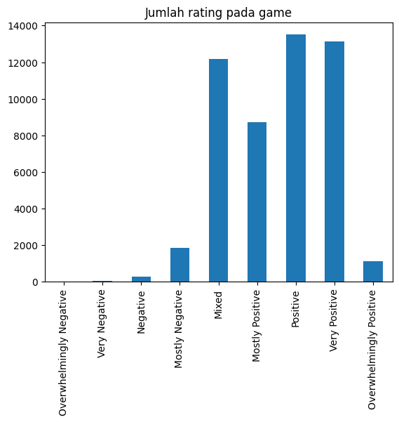
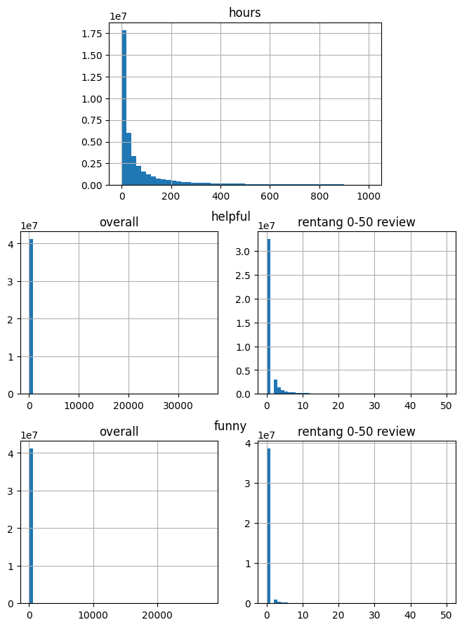

# Laporan Proyek Machine Learning - Ghifari Adil Ruchiyat

## 1. Project Overview

### Latar Belakang

Industri game telah berkembang cukup pesat dalam beberapa tahun terakhir. Hal ini dapat dipengaruhi oleh berbagai hal, seperti akses internet yang semakin mudah, perkembangan teknologi, serta popularitas eSport. Pada tahun 2017, pendapatan dari penjualan game oleh industri game terhitung sebesar $108.9 milyar USD.[^1] Di tahun 2018, terdapat sekitar 2 milyar pemain game aktif di seluruh dunia.[^2] Di Indonesia sendiri, pasar game di Indonesia masih tergolong muda. Meskipun begitu, pendapatan dari bisnis game di Indonesia tercatat telah mencapai jumlah yang sangat tinggi di tahun 2017, yakni $880 juta USD.[^3]

Perkembangan ini menciptakan peluang baru bagi pengembang dan penerbit game, tetapi juga tantangan dalam menjangkau dan mempertahankan pemain. Selain itu, dengan jumlah game yang tersedia di pasaran saat ini, menemukan game yang tepat untuk dimainkan bisa menjadi tantangan bagi banyak pengguna. Sistem rekomendasi game dapat membantu memecahkan masalah ini dengan memberikan saran yang disesuaikan dengan preferensi setiap pengguna. Hal ini tidak hanya meningkatkan pengalaman bermain game pengguna, tetapi juga membantu pengembang dan penerbit game untuk menargetkan game mereka kepada audiens yang tepat.

Tujuan proyek ini adalah untuk mengembangkan sistem rekomendasi game yang menggunakan dua pendekatan, yakni Content-Based Filtering (CBF) dan Collaborative Filtering (CF). CBF menganalisis konten game, seperti genre, tema, mekanisme gameplay, dan visual, untuk merekomendasikan game yang mirip dengan game yang disukai pengguna. CF menganalisis data rating dan interaksi pengguna dengan game untuk merekomendasikan game yang disukai pengguna lain dengan minat yang serupa.

## 2. Business Understanding

### Problem Statements

Berdasarkan latar belakang di atas, perlu dikembangkan sebuah sistem rekomendasi game untuk menjawab permasalahan berikut:
- Berdasarkan data mengenai game, bagaimana perusahaan dapat merekomendasikan game serupa dengan teknik content-based filtering?
- Berdasarkan data review game, bagaimana perusahaan dapat merekomendasikan game yang mungkin disukai dan belum pernah dimainkan oleh pengguna?

### Goals

Untuk menjawab pertanyaan tersebut, sistem rekomendasi dibuat dengan tujuan atau *goals* sebagai berikut:
- Menghasilkan sejumlah rekomendasi game dengan teknik content-based filtering
- Menghasilkan sejumlah rekomendasi game yang sesuai dengan preferensi pengguna dan belum pernah dimainkan sebelumnya.

Keberhasilan proyek ML untuk rekomendasi game akan memberikan manfaat signifikan bagi bisnis, di antaranya:
- Keterjangkauan game ke pengguna, terutama dari penerbit yang berpotensi berkembang
- Memudahkan menemukan game yang tepat untuk dimainkan bagi pengguna

### Solution statements

Untuk mencapai tujuan tersebut, solusi yang perlu dilakukan adalah sebagai berikut:
- Mengembangkan sistem rekomendasi game dengan pendekatan Content-Based Filtering (CBF)
- Mengembangkan sistem rekomendasi game dengan pendekatan Collaborative Filtering (CF)

## 3. Data Understanding

Dataset yang digunakan adalah [Game Recommendations on Steam](https://www.kaggle.com/datasets/antonkozyriev/game-recommendations-on-steam/data) oleh Anton Kozyriev, yang diambil dari _Steam Official Store_. Dataset ini mengandung tiga kategori data, yakni data game, data user, dan data review atau recommendation user terhadap game. Terdapat 50.872 data game, 14.306.064 data user, dan 41.154.794 data review.

### Deskripsi Variable

Variable pada data game adalah sebagai berikut:
 - app_id: Id unik setiap game
 - title: Judul dari game
 - description: Deskripsi pada game
 - date_release: Tanggal rilis dari game
 - tags: Daftar tag yang diberikan pada game. Tag dapat mewakili genre game seperti "Horror", "RPG", dan "Puzzle", maupun sifat game secara umum seperti "Well-Written", "Difficult", dan "Female Protagonist". Satu game umumnya memiliki lebih dari satu tag
 - win: Data boolean, apakah game tersedia untuk Windows
 - mac: Data boolean, apakah game tersedia untuk MacOS
 - linux: Data boolean, apakah game tersedia untuk Linux
 - steam_deck: Data boolean, apakah game tersedia untuk Steam Deck
 - rating: Rating sentiment dari game, mulai dari "_overwhelmingly positive_" hingga "_overwhelmingly negative_"
 - positive_ratio: Persentase feedback pada game yang bersifat positif 
 - user_reviews: Jumlah review pada game
 - price_original: Harga game sebelum diskon, dalam satuan USD
 - discount: Persentase diskon yang diberikan pada game
 - price_final: Harga game setelah diskon, dalam satuan USD

Variable pada data user adalah sebagai berikut:
- user_id: Id unik setiap user
- products: Jumlah game/add-ons yang dibeli user
- reviews: Jumlah review yang dibuat user

Variable pada data review adalah sebagai berikut:
- review_id: Id unik setiap review
- app_id: Id dari game yang diberi review
- user_id: Id dari user yang memberi review
- is_recommended: Data boolean, apakah user merekomendasikan game ini ke user lain
- helpful: Jumlah user yang merasa review ini berguna
- funny: Jumlah user yang merasa review ini menghibur atau lucu
- date: Tanggal dibuatnya review
- hours: Berapa jam user telah memainkan game tersebut saat memberikan review

Berikut adalah hasil `df.describe()` dari data game:

|       | positive_ratio | user_reviews |  price_final | price_original |   discount   |
|:-----:|:--------------:|:------------:|:------------:|:--------------:|:------------:|
| count |  50872.000000  | 5.087200e+04 | 50872.000000 |  50872.000000  | 50872.000000 |
|  mean |    77.052033   | 1.824425e+03 |   8.620325   |    8.726788    |   5.592212   |
|  std  |    18.253592   | 4.007352e+04 |   11.514164  |    11.507021   |   18.606679  |
|  min  |    0.000000    | 1.000000e+01 |   0.000000   |    0.000000    |   0.000000   |
|  25%  |    67.000000   | 1.900000e+01 |   0.990000   |    0.990000    |   0.000000   |
|  50%  |    81.000000   | 4.900000e+01 |   4.990000   |    4.990000    |   0.000000   |
|  75%  |    91.000000   | 2.060000e+02 |   10.990000  |    11.990000   |   0.000000   |
|  max  |   100.000000   | 7.494460e+06 |  299.990000  |   299.990000   |   90.000000  |

_Tabel 3.1: Hasil `df.describe()` pada data game_

Berikut adalah hasil `df.describe()` dari data user:

|       |   products   |    reviews   |
|:-----:|:------------:|:------------:|
| count | 1.430606e+07 | 1.430606e+07 |
|  mean | 1.163734e+02 | 2.876738e+00 |
|  std  | 2.438515e+02 | 7.987421e+00 |
|  min  | 0.000000e+00 | 0.000000e+00 |
|  25%  | 2.300000e+01 | 1.000000e+00 |
|  50%  | 5.500000e+01 | 1.000000e+00 |
|  75%  | 1.270000e+02 | 3.000000e+00 |
|  max  | 3.221400e+04 | 6.045000e+03 |

_Tabel 3.2: Hasil `df.describe()` pada data user_

Berikut adalah hasil `df.describe()` dari data review:

|       |    helpful   |     funny    |     hours    |
|:-----:|:------------:|:------------:|:------------:|
| count | 4.115479e+07 | 4.115479e+07 | 4.115479e+07 |
|  mean | 3.202567e+00 | 1.058071e+00 | 1.006022e+02 |
|  std  | 4.693649e+01 | 2.867060e+01 | 1.761675e+02 |
|  min  | 0.000000e+00 | 0.000000e+00 | 0.000000e+00 |
|  25%  | 0.000000e+00 | 0.000000e+00 | 7.800000e+00 |
|  50%  | 0.000000e+00 | 0.000000e+00 | 2.730000e+01 |
|  75%  | 0.000000e+00 | 0.000000e+00 | 9.920000e+01 |
|  max  | 3.621200e+04 | 2.810900e+04 | 1.000000e+03 |

_Tabel 3.3: Hasil `df.describe()` pada data review_

### Exploratory Data Analysis

Berikut adalah hasil analisis dari data tersebut:

1. Top 10 tag pada game

    Terdapat 441 tag unik pada data game. Berikut adalah grafik dari 10 tag terbanyak:

    

    _Gambar 3.1: Sepuluh tag terbanyak pada game Steam_

    Dari grafik pada gambar 3.1, didapat observasi sebagai berikut:

    - Tag "Indie" adalah tag yang paling banyak ditemukan di antara game-game di Steam, dengan lebih dari 25.000 game yang memiliki tag ini. Hal ini menunjukkan bahwa banyak game pada Steam dibuat oleh developer independen, bukan perusahaan besar.
    - Tag "Singleplayer" juga cukup banyak, dengan lebih dari 20.000 game memiliki tag ini. Hal ini menunjukkan bahwa banyak game pada Steam dibuat untuk dinikmati sendiri.
    - Tag "Action" dan "Adventure" juga sangat populer, dengan sekitar 20.000 game memiliki tag ini. Hal ini mengindikasikan bahwa banyak game yang ada bersifat penuh aksi dan petualangan.
    - Tag "Casual" juga banyak ditemui meskipun tidak sebanyak tag sebelumnya, dengan sekitar 18.000 game memiliki tag ini. Hal inimenunjukkan bahwa banyak game pada Steam sifatnya mudah dimainkan dan tidak memerlukan banyak waktu.
    - Tag "Simulation" muncul dalam sekitar 13.000 game. Hal ini menunjukkan ketertarikan game yang mensimulasikan dunia nyata, seperti game simulasi penerbangan atau simulasi kehidupan.
    - Tag "2D", "Strategy", "RPG", "Atmospheric" masing-masing muncul dalam sekitar 10.000 game. Meskipun memiliki frekuensi yang lebih rendah dibandingkan dengan tag lainnya dalam 10 besar ini, mereka tetap mewakili segmen penting dari pasar game. Ini menunjukkan keanekaragaman dalam preferensi genre, seperti game strategi, RPG, hingga game yang memiliki suasana yang menarik.

2. Wordcloud tag

    Berikut adalah gambar wordcloud dari tag pada game:

    

    _Gambar 3.2: Wordcloud dari tag_

    Dari gambar 3.2, didapat observasi sebagai berikut:

    - Tag "Adventure", "Action", "Singleplayer", dan "Indie" adalah tag yang paling sering muncul pada game, ditandai dengan ukuran font yang besar.
    - Tag "Atmospheric", "Strategy", dan "Simulation" tidak sepopuler tag lainnya, tetapi masih cukup signifikan.
    - Tag "Casual", "RPG", "Multiplayer", "Story Rich", dan "Puzzle" juga terlihat dalam word cloud, menunjukkan bahwa mereka juga merupakan tag yang cukup populer dalam banyak game.
    - Secara keseluruhan, word cloud ini menunjukkan keanekaragaman besar dalam jenis game yang ada pada data.

3. Jumlah rating game

    Berikut adalah grafik histogram yang menunjukkan banyaknya game yang mendapat rating tertentu:

    

    _Gambar 3.3: Grafik frekuensi rating game_

    Dari gambar 3.3, didapat observasi berikut:

    - Sebagian besar game memiliki rating "Mixed" hingga "Very Positive". Terdapat lebih dari 12000 game yang memiliki rating "Mixed", "Positive", atau "Very Positive". Hal ini menunjukkan bahwa sebagian besar game di Steam mendapatkan review positif dari pemainnya.
    - Game dengan rating "Overwhelmingly Negative" hingga "Mostly Negative" relatif sedikit. Hal ini menunjukkan bahwa sedikit game di Steam yang mendapatkan rating negatif dari user dalam jumlah besar

4. Histogram data game

    Berikut adalah grafik histogram dari feature ratio_positive, price_original, discount, dan price_final pada data game

    

    _Gambar 3.4: Grafik histogram beberapa data game_

    Dari grafik histogram pada gambar 3.4, didapat observasi berikut:

    - Pada fitur ratio_positive, sebagian besar game memiliki rasio positif tinggi, yang menunjukkan bahwa sebagian besar game mendapatkan review yang positif. Namun perlu diperhatikan bahwa data ini tidak mencerminkan rating game secara keseluruhan. Game dengan hanya 5 review, namun semua reviewnya positif, dapat menghasilkan rasio positif sebesar 100%, yang dapat menjelaskan tingginya rasio positif 100%. Beberapa puncak data juga terlihat, misalnya pada rasio positif sebesar 80% dan 90%.
    - Pada fitur price_original, sebagian besar game memiliki harga asli di bawah $50. Walaupun begitu, terdapat beberapa outlier dengan game yang harganya mencapai hingga $300.
    - Pada fitur discount, sejumlah besar game tidak menawarkan diskon atau diskon sangat minimal, yakni sekitar 0-20%. Namun, ada lonjakan yang jelas sekitar 50% dan 90%, yang menunjukkan event penjualan khusus atau promosi di mana terdapat diskon yang ditawarkan.
    - Pada fitur price_final, sebagian besar game juga memiliki harga yang rendah setelah diskon. Data histogram price_final juga mirip dengan data histogram price_original, yang menunjukkan sedikit diskon yang ada pada sebagian besar game.

    Berikut adalah grafik histogram dari feature user_review pada data game.

    

    *Gambar 3.5: Grafik histogram user_review data game. Grafik di sebelah kiri adalah data keseluruhan. Grafik sebelah kanan adalah histogram dalam rentang 0 sampai 2000 review*

   Dari grafik histogram pada gambar 3.5, didapat observasi berikut:

    - Sebagian besar game memiliki jumlah review yang sangat rendah, namun terdapat outlier dengan game yang memiliki review sebanyak lebih dari 6 juta. Secara keseluruhan, histogram ini menunjukkan bahwa distribusi jumlah review game pada data sangat tidak merata.
    - Sebagian besar game memiliki jumlah review yang rendah, yakni di bawah 500 review. Hal ini menunjukkan bahwa sebagian besar game mungkin tidak terlalu populer, atau baru saja dirilis dan belum mendapatkan banyak review.

5. Histogram data review

    Berikut adalah grafik histogram dari data review

    

    *Gambar 3.6: Grafik histogram dari data review*

    Dari grafik histogram pada gambar 3.6, didapat observasi berikut:

    - Pada fitur hours, terlihat bahwa sebagian besar pengguna memberikan review setelah bermain selama kurang dari 200 jam. Hal ini dapat menunjukkan bahwa sebagian besar game memang memiliki waktu main yang cukup singkat, atau banyak pengguna memberikan review awal berdasarkan pengalaman bermain game mereka yang relatif singkat.
    - Pada fitur helpful dan funny, terlihat bahwa hampir semua review berada di bawah 10. Hal ini menunjukkan bahwa mayoritas review tidak mendapatkan banyak vote helpful ataupun funny. Walaupun begitu, terdapat beberapa review dengan jumlah helpful dan funny yang tinggi. Review ini mungkin berisi informasi yang bermanfaat bagi user lain atau review yang lucu dan menghibur.

6. Histogram data user

    Berikut adalah grafik histogram dari data user

    

    *Gambar 3.7: Grafik histogram dari data user*

    Dari grafik histogram pada gambar 3.7, didapat observasi berikut:

    - Pada fitur products, terlihat bahwa sebagian besar pengguna memiliki di bawah 200 produk, dan terdapat outlier yang mencapai 30000 produk. Hal ini dapat menunjukkan bahwa sebagian besar pengguna cenderung memiliki jumlah game atau add-ons yang terbatas, yang dapat dipengaruhi oleh preferensi pribadi, keterbatasan waktu, atau faktor biaya
    - Pada fitur reviews, terlihat bahwa sebagian besar pengguna memberikan di bawah 10 review, dan terdapat outlier yang mencapai 6000 produk. Hal ini dapat menunjukkan bahwa hanya sedikit pengguna yang aktif memberikan review, misalnya karena banyak pengguna yang memilih untuk bermain game daripada menulis review, atau karena mereka hanya memberikan review untuk game tertentu yang mereka sukai atau tidak sukai

7. Grafik rekomendasi game pada review

    Berikut adalah grafik yang menunjukkan data pada fitur is_recommended

    

    *Gambar 3.8: Grafik histogram dari data pada fitur is_recommended*

    Dari grafik diatas, terlihat bahwa review dengan label "True" (merekomendasikan game) berjumlah sekitar 35 juta, sedangkan review dengan label "False" (tidak merekomendasikan game) berjumlah sekitar 5 juta. Jumlah review dengan label "True" jauh lebih banyak dibandingkan dengan review dengan label "False". Hal ini menunjukkan bahwa sebagian besar user cenderung menyukai dan merekomendasikan game yang mereka mainkan, walaupun terdapat beberapa review negatif.

8. Lain-lain

    Selain grafik di atas, didapat beberapa fakta lain saat melakukan EDA, yakni sebagai berikut:
    
    - Dari 50872 game yang ada, terdapat 1244 game yang tidak memiliki tag sama sekali. Game-game yang tidak memiliki tag banyak yang berasal dari game populer, seperti "Fallout 4", "Half-Life: Alyx", "Portal 2", dan "Team Fortress 2". Hal ini dapat menjadi tantangan karena sistem mungkin tidak memiliki informasi yang cukup untuk membuat rekomendasi.

    - Ada 121 game yang memiliki nama yang sama persis tetapi sebenarnya adalah game yang berbeda. Misalnya, terdapat dua game berbeda dengan nama "Lighthouse Keeper" - yang satu adalah game horror eksperimental dengan grafik pixel, sedangkan game lainnya adalah game survival santai dengan grafik 3D. Hal ini juga bisa menjadi tantangan saat membangun sistem rekomendasi karena bisa membingungkan model. Oleh karenanya, penting untuk memastikan bahwa sistem rekomendasi dapat membedakan game-game ini, misalnya dengan memasukkan fitur tambahan seperti tanggal rilis atau tag ke dalam model, atau dengan menggunakan identifier lain saat memberikan rekomendasi seperti id game.

## 4. Data Preparation

### Content-Based Filtering

Untuk content-based filtering, data preparation yang dilakukan adalah sebagai berikut:

1.  Mengambil app_id, title, dan tags dari data game

    Pendekatan content-based filtering akan dilakukan dengan melihat tag dari game yang serupa, sehingga data yang diperlukan adalah data id game, nama game, serta daftar tag dari game tersebut.

2.  Drop game yang tidak memiliki tag

    Content dari game akan ditentukan berdasarkan tag dari game. Content tidak bisa didapat jika game tidak memiliki tag, sehingga tidak akan digunakan.

3.  Vektorisasi TF-IDF

    TF-IDF digunakan untuk memberikan bobot pada tag game. Teknik ini akan digunakan pada sistem rekomendasi untuk menemukan representasi fitur penting dari setiap tag pada game. Dengan demikian, TF-IDF dapat menyoroti tag yang unik dan relevan untuk setiap game, yang dapat membantu dalam memberikan rekomendasi yang lebih akurat.

### Collaborative Filtering

Untuk Collaborative filtering, data preparation yang dulakukan adalah sebagai berikut:

1.  Mengambil app_id, user_id, dan is_recommended dari data review

    Pendekatan collaborative filtering akan dilakukan dengan melihat apakah user merekomendasikan game tersebut ke user lain dalam reviewnya, sehingga akan diambil fitur yang diperlukan, yakni id_game, id_user, dan is_recommended

2.  Mengambil review dengan is_recommended == True

    Dari data review, hanya akan diambil data dengan nilai is_recommended bernilai True. Review negatif tidak akan digunakan untuk menyederhanakan data.

3.  Membuat user-item matrix

    Matriks ini adalah representasi dari interaksi antara user dan game, dimana tiap baris mewakili id user dan tiap kolom mewakili id game. Nilai dalam matriks adalah indikasi dari preferensi pengguna terhadap item. Dalam matriks ini, nilai di dalamnya adalah 1 untuk setiap data dengan is_recommended yang bernilai True. Matriks ini akan digunakan sebagai input untuk algoritma Collaborative Filtering.

## 5. Modeling

### Content-Based Filtering

_Content-Based Filtering_ adalah pendekatan yang digunakan dalam sistem rekomendasi berdasarkan konten item yang disarankan. Dalam konteks sistem rekomendasi game, pendekatan ini menganalisis fitur pada game, misalnya seperti rating atau genre dari game, untuk memberikan rekomendasi yang relevan pada user. Harapannya, _Content-Based Filtering_ dapat memberikan rekomendasi yang mirip dengan suatu item.

Kelebihan dari _Content-Based Filtering_ adalah:

- Dapat merekomendasikan item yang bahkan belum diberi rating oleh user lain
- Dapat memberikan penjelasan yang jelas tentang alasan di balik rekomendasi yang diberikan
- Dapat memberikan rekomendasi yang lebih personal karena mempertimbangkan preferensi individual user

Sedangkan kekurangan dari _Content-Based Filtering_ adalah:

- Tidak dapat memberikan rekomendasi yang baik jika deskripsi item tidak akurat atau lengkap 
- Hasil rekomendasi seringkali kurang bervariasi

Untuk implementasi  _Content-Based Filtering_, akan digunakan model K-Nearest Neighbor (KNN). KNN adalah salah satu algoritma yang sederhana dan umumnya digunakan dalam klasifikasi data. Algoritma ini bekerja dengan mengelompokkan data berdasarkan jarak terdekat dengan tetangga lainnya. Umumnya, KNN digunakan untuk permasalahan supervised learning seperti klasifikasi atau regresi. Namun KNN dapat digunakan untuk unsupervised learning, dengan hanya melakukan pencarian tetangga terdekat dari suatu data yang diinginkan. KNN dipilih karena mudah diimplementasikan dan dipahami, serta tidak ada fase pelatihan, yang dapat mempercepat pembuatan model.

Untuk melakukan pengujian model, digunakan game dengan id 445980 dengan data sebagai berikut:

| app_id | title | tags |
|:-------|:------|:-----|
| 445980 | Wizard of Legend | Action Roguelike, Pixel Graphics, Roguelike, Action, Dungeon Crawler, Local Co-Op, Magic, Multiplayer, Adventure, Roguelite, Indie, Co-op, Hack and Slash, Local Multiplayer, Difficult, 2D, Singleplayer, RPG, Procedural Generation, Fast-Paced |

_Tabel 5.1: Game yang akan diuji untuk Content-Based Filtering_

Berikut adalah lima game hasil rekomendasi dari game pada tabel 5.1:

|  app_id | title | tags |
|:--------|:------|:----:|
|  314410 |          Rampage Knights | Co-op, Action Roguelike, Action, "Beat em up", Roguelike, Indie, Multiplayer, Adventure, RPG, Local Co-Op, Online Co-Op, Roguelite, Dungeon Crawler, 2D, Funny, Hack and Slash, Difficult, Side Scroller, Procedural Generation, Local Multiplayer |
| 1321010 |         Labyrinth Legend | Hack and Slash, Action RPG, Dungeon Crawler, Pixel Graphics, RPG, Procedural Generation, Local Multiplayer, Local Co-Op, Action, Indie, Co-op, Fantasy, Old School, Singleplayer, Multiplayer, 2D, Controller, Adventure, Roguelike, Roguelite |
|  330020 |        Children of Morta | Multiplayer, Roguelike, Hack and Slash, Action Roguelike, Roguelite, Online Co-Op, Pixel Graphics, RPG, Action, Local Co-Op, Dungeon Crawler, Singleplayer, Story Rich, Co-op, Isometric, Action RPG, 2D, Procedural Generation, Fantasy, Action-Adventure |
|  492410 |           Rogues Like Us | Action Roguelike, Action, Indie, Roguelite, Hack and Slash, Difficult, Roguelike, Dungeon Crawler, Early Access, Local Co-Op |
| 1280930 |            Astral Ascent | Roguelite, Action Roguelike, Pixel Graphics, Hack and Slash, 2D Platformer, Platformer, Action, Roguelike, Solitaire, 2D, Fantasy, Magic, Co-op, Adventure, Local Co-Op, Singleplayer, Multiplayer, Local Multiplayer, Early Access, Indie |

_Tabel 5.2: Hasil rekomendasi dengan CBF berdasarkan game pada tabel 5.1_

### Collaborative Filtering

_Collaborative Filtering_ atau CF adalah pendekatan yang digunakan dalam sistem rekomendasi, yang memanfaatkan data dari sesama pengguna untuk memberikan rekomendasi. Pendekatan ini bertujuan untuk mengidentifikasi tren kolaboratif di antara pengguna dan item yang disarankan, diambil dari interaksi atau preferensi mereka.

Kelebihan dari _Collaborative Filtering_ adalah:

- Dapat memberikan rekomendasi pada item yang kontennya sulit didapat
- Dapat memberikan rekomendasi yang lebih bervariasi, berdasarkan kesamaan dengan user lain
- Mampu menangkap pola dan asosiasi yang mungkin tidak terlihat pada Content-Based Filtering

Sedangkan kekurangan dari _Collaborative Filtering_ adalah:

- Sulit memberikan rekomendasi pada user baru, karena belum memiliki data tentang preferensi mereka (Cold-start problem)
- Membutuhkan perhitungan yang kompleks, terutama pada dataset yang besar

Untuk implementasi  _Collaborative Filtering_, akan digunakan model K-Means clustering. Algoritma K-Means adalah algoritma yang biasa digunakan untuk kasus clustering. K-Means bekerja dengan memilih beberapa titik data awal (k) secara acak, lalu memindah-mindahkannya hingga pengelompokan yang paling ideal ditemukan. Harapannya, tiap-tiap kelompok atau cluster ini mencerminkan data yang sifatnya mirip. K-Means dipilih karena sifatnya yang sederhana dan mampu digunakan pada dataset yang berjumlah besar.

Untuk melakukan pengujian model, akan digunakan user dengan id 51580. User tersebut merekomendasikan game berikut:

|  app_id |                              title | date_release |                  rating | positive_ratio | user_reviews |
|:-------:|:-----------------------------------|:-------------|:-----------------------:|:--------------:|:------------:|
| 1817190 | Marvel’s Spider-Man: Miles Morales |   2022-11-18 |           Very Positive |             94 |        16625 |
|  379720 |                               DOOM |   2016-05-12 | Overwhelmingly Positive |             95 |       121343 |
|  590380 |                    Into the Breach |   2018-02-27 |           Very Positive |             94 |        14489 |
|  975370 |                     Dwarf Fortress |   2022-12-06 | Overwhelmingly Positive |             95 |        19665 |
| 1649080 |                   Two Point Campus |   2022-08-09 |           Very Positive |             88 |         2421 |

_Tabel 5.3: Game yang direkomendasikan oleh user yang akan diuji_

Hasil rekomendasi berdasarkan tabel 5.3 adalah sebagai berikut:

| app_id | title | date_release | rating | positive_ratio | user_reviews |
|-------:|:------|:-------------|:------:|:--------------:|:------------:|
|  546560 | Half-Life: Alyx |   2020-03-23 | Overwhelmingly Positive | 98 |        71472 |
| 1237970 |    Titanfall® 2 |   2020-06-18 |           Very Positive | 94 |       154419 |
|  611500 | Quake Champions |   2022-08-18 |         Mostly Positive | 73 |        36191 |
|     440 | Team Fortress 2 |   2007-10-10 |           Very Positive | 93 |       985819 |
|    2280 |     DOOM (1993) |   2007-08-03 | Overwhelmingly Positive | 96 |        13070 |

_Tabel 5.4: Hasil rekomendasi dengan CF berdasarkan tabel 5.3_

## 6. Evaluation

Metrik evaluasi yang akan digunakan untuk mengukur kinerja model adalah sebagai berikut:

1. Precision@k 

    Precision@k adalah metrik yang digunakan untuk mengukur kecocokan antara bagian data yang diambil dengan informasi yang dibutuhkan. Precision@k menunjukkan banyaknya hasil rekomendasi yang relevan, dari total rekomendasi yang dibuat. Rumus dari precision@k adalah

    $$\text{Precision@k} = \frac{\text{Jumlah rekomendasi yang relevan}}{\text{Jumlah rekomendasi}}$$

    Nilai presisi yang tinggi menunjukkan bahwa model jarang membuat prediksi positif yang salah, sehingga prediksi positifnya dapat lebih dipercaya.

    Dalam Content-Based Fitering, rekomendasi yang relevan adalah item rekomendasi yang memiliki sifat yang serupa dengan item target. Dalam konteks proyek ini, rekomendasi game yang relevan adalah game yang memiliki tag yang mirip dengan game target. Kemiripan ini akan diukur dengan menggunakan Jaccard Score.

    Jaccard score adalah score yang digunakan untuk mengukur kesamaan dari dua himpunan. Jaccard score mengukur rasio dari irisan dan gabungan kedua himpunan tersebut. Rumusnya adalah

    $$\text{Jaccard Score} = \frac{|A \cap B|}{|A \cup B|}$$

    dimana $A$ dan $B$ adalah dua himpunan yang akan dicari kesamaannya.
    
    Jaccard score memiliki rentang dari 0 hingga 1. Score mendekati 1 menandakan kedua himpunan tersebut sangat mirip, sedangkan score mendekati 0 menandakan kedua himpunan tersebut sangat berbeda.

    Pada proyek ini, game yang direkomendasikan akan dikatakan relevan jika memiliki Jaccard score sebesar 0.5 atau lebih dengan game target.

2. Silhouette score

    Silhouette score adalah metrik yang digunakan untuk mengevaluasi kualitas hasil dari algoritma clustering. Silhouette score mengukur seberapa dekat suatu titik data dengan anggota clusternya sendiri dibandingkan dengan cluster lainnya.

    Silhouette score untuk datapoint $i$ paca cluster $C_i$ dihitung dengan rumus
    
    $$s_i = \frac{b_i - a_i}{max(b_i,a_i)}$$

    Dimana:
    
    - $s_i$: Silhouette score untuk datapoint $i$
    - $a_i$: Rata-rata jarak antara $i$ dengan data lain pada cluster yang sama
    - $b_i$: Rata-rata dari jarak antara $i$ dengan data lain pada cluster terdekat yang berbeda

    Nilai $a_i$ didapat dengan rumus berikut:

    $$a_i = \frac{1}{C_i - 1} \sum_{j \in C_i, i \ne j} d(i,j)\$$

    Sedangkan nilai $b_i$ didapat dengan rumus berikut:

    $$b_i = \min_{k \ne i} \frac{1}{C_k} \sum_{j \in C_k} d(i,j)\$$

    dimana $d(i,j)$ adalah jarak antara datapoint $i$ dan $j$. 

    Nilai silhouette score untuk datapoint $i$ berkisar antara -1 sampai 1. Silhouette score mendekati 1 menandakan titik data tersebut berada sangat dekat dengan pusat clusternya sendiri dan jauh dari cluster lainnya. Hal ini menunjukkan pembagian data yang baik ke dalam cluster. Silhouette score mendekati 0 menandakan titik data tersebut berada di antara dua cluster. Silhouette score negatif menandakan bahwa titik data tersebut lebih dekat dengan pusat cluster lain dibandingkan dengan clusternya sendiri.
    
    Silhouette score biasanya dihitung sebagai rata-rata silhouette score untuk semua titik data dalam dataset. Nilai rata-rata yang lebih tinggi menunjukkan kualitas clustering yang lebih baik.

Berikut adalah hasil evaluasi untuk pendekatan _Content-Based Filtering_ dan _Collaborative Filtering_

### Content-Based Filtering

Tabel berikut menunjukkan Jaccard score dari game yang direkomendasikan dengan game target pada tabel 5.1.

| Game yang direkomendasikan | Jaccard score       |
|:---------------------------|:--------------------|
| Rampage Knights            | 0.6666666666666666  |
| Labyrinth Legend           | 0.6666666666666666  |
| Children of Morta          | 0.5384615384615384  |
| Rogues Like Us             | 0.42857142857142855 |
| Astral Ascent              | 0.6                 |

_Tabel 6.1: Jaccard score dari game hasil rekomendasi_

Terlihat bahwa 4 dari 5 game yang direkomendasikan memiliki nilai jaccard score diatas 0.5. Sehingga precision@k untuk sistem rekomendasi ini adalah 4/5 atau 0,8. Hal ini menandakan bahwa dari 5 game yang direkomendasikan,  4 di antaranya adalah rekomendasi yang baik dan sesuai dengan preferensi pengguna. Nilai ini cukup tinggi, menunjukkan bahwa model dapat memberikan rekomendasi yang relevan.

### Collaborative Filtering

Mengingat jumlah data yang cukup besar, perhitungan Silhouette score dilakukan pada 100.000 data sampel acak. Didapat hasil perhitungan Silhouette scorenya sebagai berikut:

```
0.21968125181380824
```

Hasil silhouette score menunjukkan bahwa model dapat mengelompokkan data dengan cukup baik, dengan nilai silhouette score sekitar 0.22. Dalam konteks sistem rekomendasi ini, user dapat menemukan game yang mereka sukai dalam cluster yang sama. Namun, nilai ini masih jauh dari 1, yang dapat menunjukkan beberapa sampel tidak cocok dengan baik dengan kluster mereka, atau mungkin ada terlalu banyak atau terlalu sedikit kluster.

## 7. Kesimpulan

Dari hasil evaluasi di atas, kedua model telah menunjukkan kinerja yang cukup baik dalam memberikan rekomendasi game yang relevan dan akurat. Namun, selalu ada ruang untuk peningkatan dan optimasi lebih lanjut. Proyek ini menunjukkan bahwa sistem rekomendasi game dapat dibangun dengan menggunakan dua pendekatan, yakni Content-Based Filtering dan Collaborative Filtering. Kedua pendekatan ini dapat membantu pengguna menemukan game yang mereka sukai dengan lebih mudah, serta membantu pengembang game untuk mencapai pemain baru.

## Referensi:

[^1]:	J. Che, “Study on videogame industry and its general developing trend,” in Proceedings at the 5th annual conference on business, economics, and management, 2018.
[^2]:	R. Baltezarević, B. Baltezarević, and V. Baltezarević, “The video gaming industry: From play to revenue,” Int. Rev., no. 3–4, pp. 71–76, 2018.
[^3]:	A. Mulachela, “Analisis Perkembangan Industri Game di Indonesia Melalui Pendekatan Rantai Nilai Global (Global Value Chain),” Indones. J. Glob. Discourse, vol. 2, no. 2, pp. 32–51, Dec. 2020, doi: 10.29303/ijgd.v2i2.17.